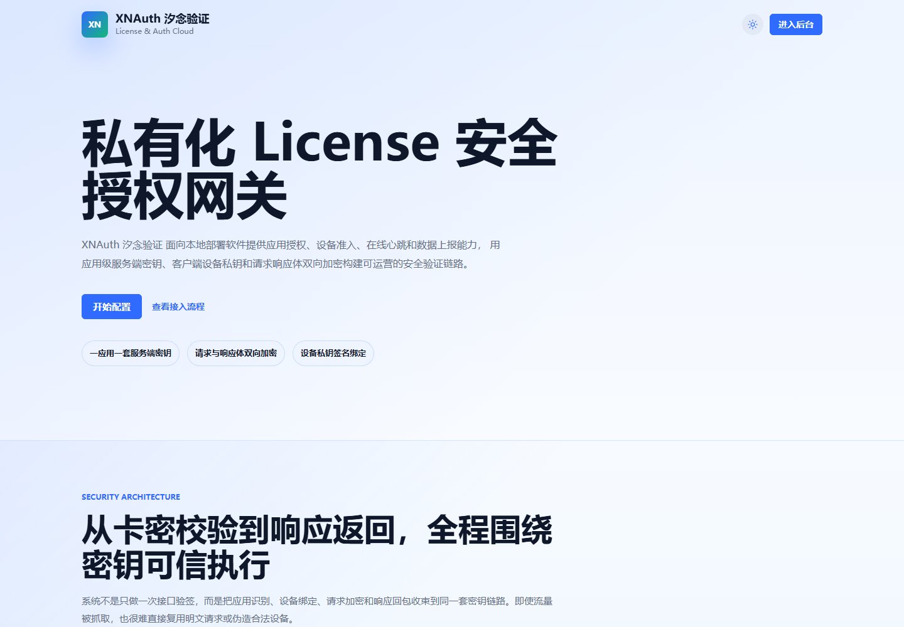
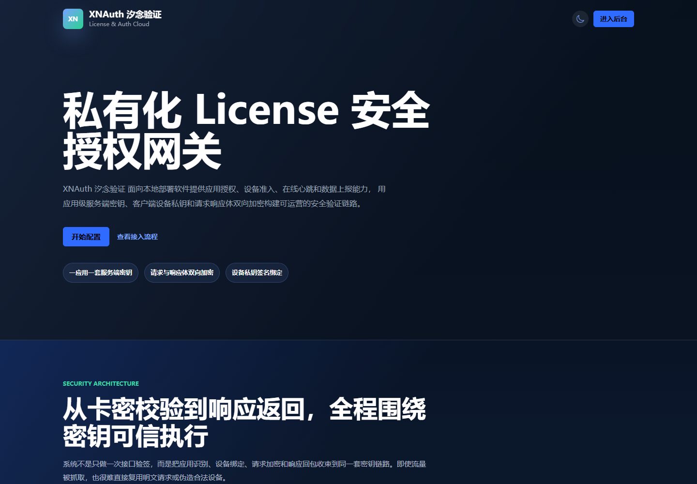
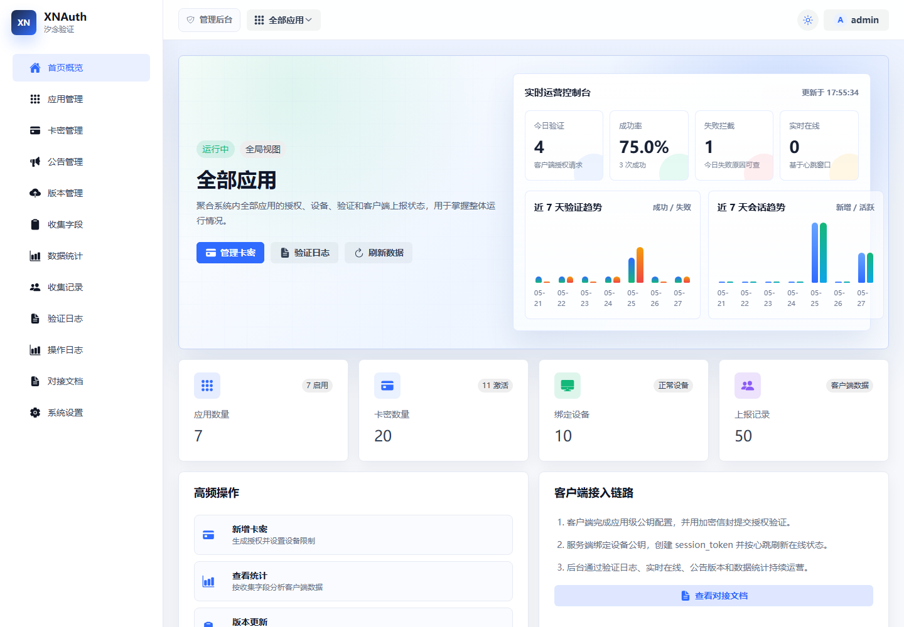
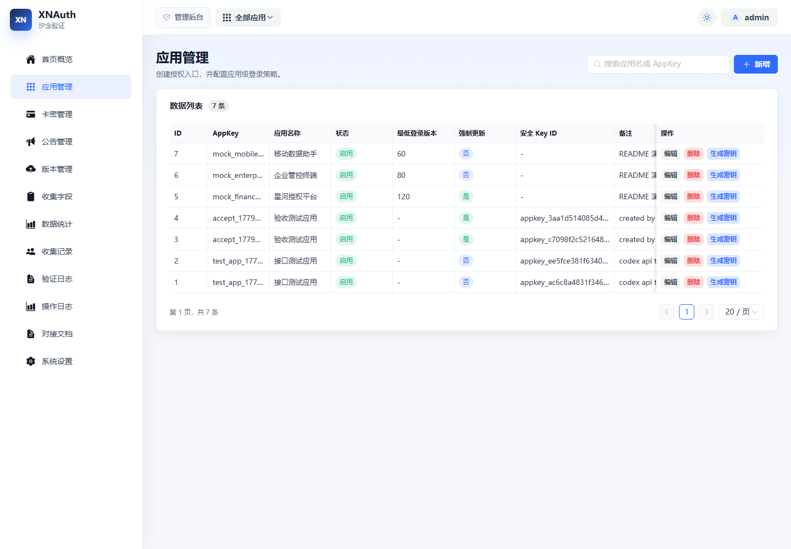
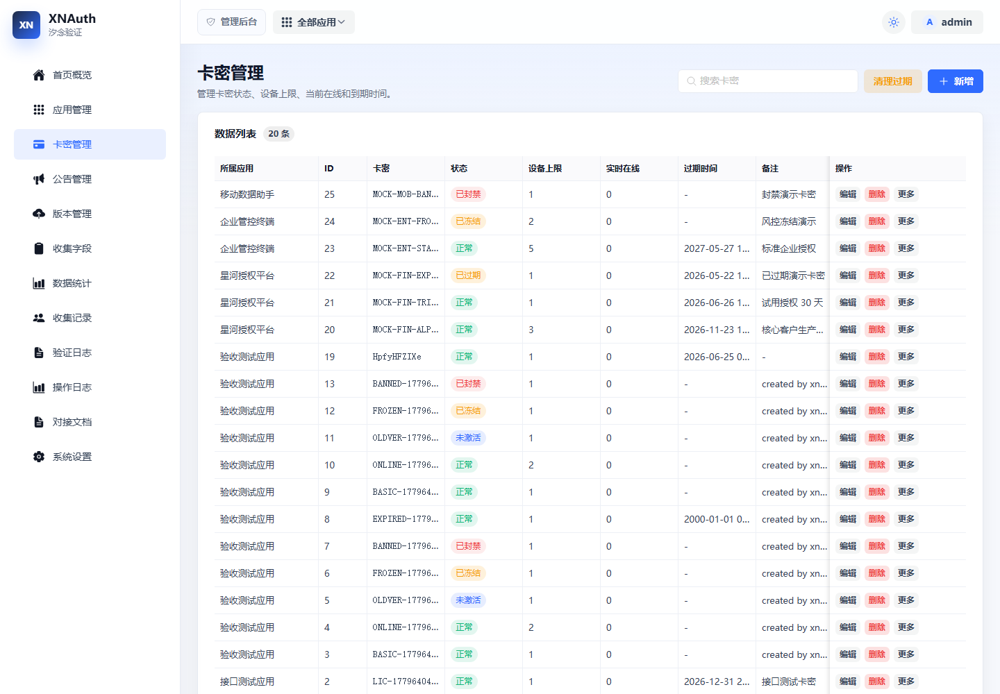
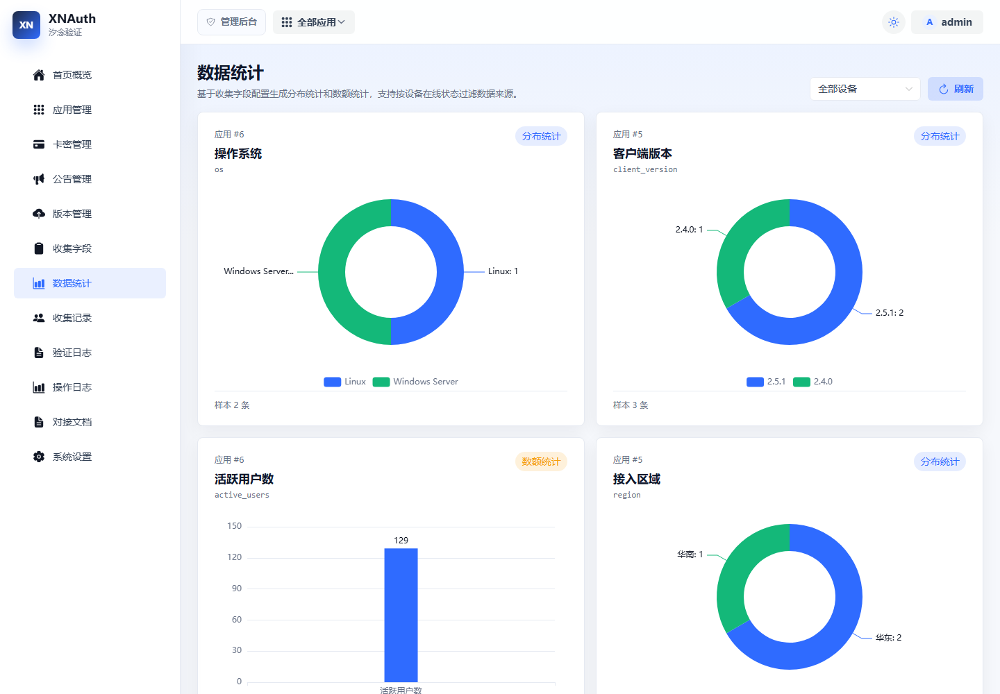
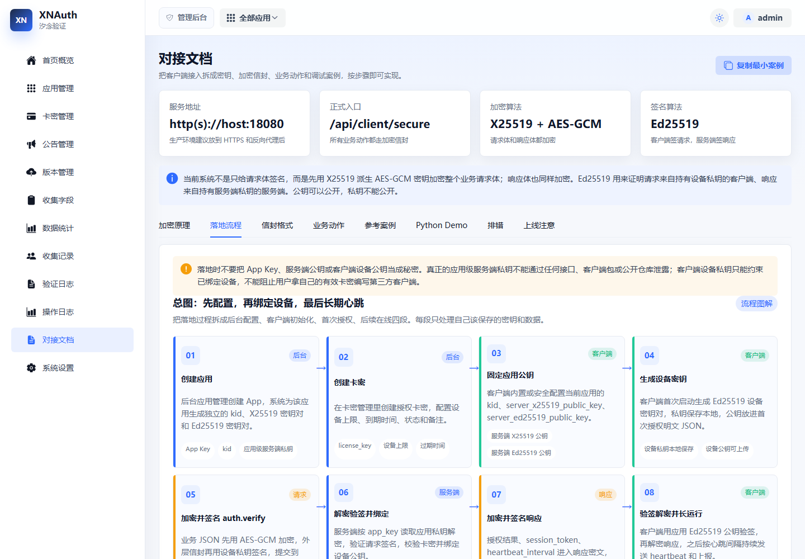
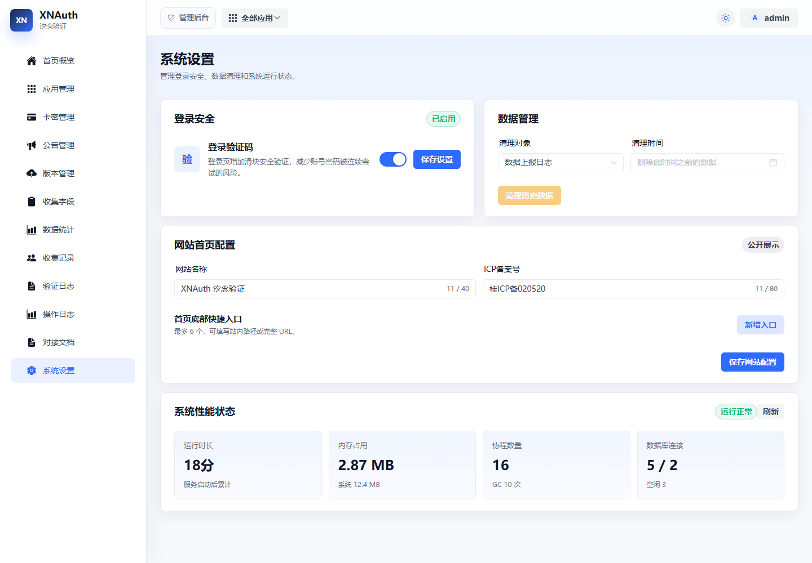

# XNAuth 汐念验证

XNAuth 是一个面向本地部署软件的网络授权管理系统，用于集中管理应用授权、卡密、设备绑定、在线心跳、公告版本和客户端数据上报。系统提供 Go 后端、Vue 管理后台、公开网站首页、客户端安全接入协议和 Python 演示客户端。

项目当前定位为私有化 License / Auth 网关。它不是单纯的“卡密查询接口”，而是围绕应用级密钥、客户端设备密钥、请求响应体加密、实时会话和后台运营数据组成一套完整的授权控制链路。

## 项目展示

以下截图基于本地 mock 数据生成，可用于 README、部署说明或项目介绍材料。

### 网站首页





### 管理后台













## 功能特性

- 多应用管理：每个应用独立维护卡密、公告、版本、收集字段、验证日志和应用级服务端密钥。
- 卡密授权：支持卡密创建、编辑、状态管理、过期时间、设备上限、过期清理和完整卡密展示。
- 设备绑定：客户端首次验证后绑定机器码，后台可在卡密详情中禁用、启用或解绑指定设备。
- 在线心跳：客户端按固定频率上报心跳，后台按心跳窗口统计实时在线设备并支持强制下线。
- 公告与版本：客户端可独立拉取公告和更新信息，应用最低登录版本和强制更新策略由应用配置管理。
- 数据收集：后台可配置客户端上报字段，支持收集记录查看和基于字段的数据统计。
- 验证日志：记录授权成功、失败原因、客户端版本、机器码哈希和客户端 IP，便于排查问题。
- 操作日志：记录后台关键操作，便于审计卡密、设备、公告、版本和系统配置变更。
- 系统设置：支持登录安全设置、历史数据清理、网站首页名称、ICP备案号和首页底部入口配置。
- 管理后台：Vue 3 + Naive UI 构建，支持亮色、暗色和跟随系统主题，兼容移动端操作。
- 对接文档：后台内置对接文档页面，说明安全信封、业务动作和 Python Demo 接入方式。

## 安全设计

XNAuth 推荐正式客户端统一接入 `/api/client/secure` 安全入口。

安全传输由以下机制组成：

- 应用级服务端密钥：每个应用单独配置 X25519 和 Ed25519 密钥对，避免应用之间共用同一套服务端密钥。
- 请求体加密：客户端使用 X25519 与服务端应用公钥协商密钥，并用 AES-GCM 加密业务请求体。
- 响应体加密：服务端使用同一次请求派生出的密钥加密业务响应体。
- 设备私钥签名：客户端设备使用本地 Ed25519 私钥签名请求，服务端保存设备公钥用于后续验签。
- 响应签名：服务端使用当前应用 Ed25519 私钥签名响应信封，客户端用内置应用公钥验签。
- 防重放：请求携带随机数 nonce 和时间戳，服务端按设备记录并拒绝重复请求。

需要注意的安全边界：

- 应用级服务端私钥只能保存在服务端数据库或密钥管理系统中，不能进入客户端代码或公开仓库。
- 客户端只应内置当前应用的服务端公钥，公钥可公开，私钥不能公开。
- 客户端设备私钥用于证明“仍是同一个已绑定设备”，如果该私钥泄露，攻击者可以冒充该设备。
- Python Demo 为演示方便会把设备私钥写入本地文件，生产客户端应使用系统安全存储或容器密钥挂载方案。

## 技术栈

后端：

- Go 1.22
- Gin
- GORM
- MySQL 8
- Zap
- Ed25519 / X25519 / HKDF-SHA256 / AES-GCM

前端：

- Vue 3
- TypeScript
- Vite
- Pinia
- Vue Router
- Naive UI
- ECharts

演示：

- Python 安全客户端 Demo

## 项目结构

```text
.
├── cmd
│   └── server             # 后端服务入口
├── internal
│   ├── admin              # 管理员账号、登录和验证码
│   ├── adminapi           # 后台管理接口
│   ├── clientapi          # 客户端授权、心跳、公告、更新和安全信封接口
│   ├── collect            # 客户端数据上报和统计查询
│   ├── database           # MySQL 连接
│   ├── model              # 数据模型
│   ├── router             # 路由注册
│   ├── securetransport    # 请求/响应加密信封
│   └── signature          # Ed25519 签名工具
├── migrations             # MySQL 初始化脚本
├── pkg                    # 通用响应、分页和工具函数
├── pythondemo             # Python 加密客户端演示
├── web                    # Vue 管理后台和公开首页
├── config.example.yaml    # 配置样例
└── LICENSE                # 非商业开源许可证
```

## 环境要求

- Go 1.22 或更高版本
- Node.js 18 或更高版本
- MySQL 8
- npm
- 可选：Nginx，用于生产环境托管前端静态文件和反向代理 API

## 快速开始

### 1. 创建数据库

初始化脚本会创建默认数据库 `auth` 并创建全部表结构：

```powershell
Get-Content .\migrations\001_init.sql | mysql -uroot -proot
```

如果数据库账号密码不是 `root/root`，请替换命令中的账号密码。若要使用其他数据库名，请先修改 `migrations/001_init.sql` 顶部的 `CREATE DATABASE` 和 `USE` 语句，并同步修改 `config.yaml` 中的 MySQL DSN。

### 2. 准备配置

复制配置样例：

```powershell
Copy-Item .\config.example.yaml .\config.yaml
```

修改 `config.yaml` 中的数据库连接和后台令牌密钥：

```yaml
server:
  addr: "0.0.0.0:18080"
  mode: "release"

mysql:
  dsn: "root:root@tcp(127.0.0.1:3306)/auth?charset=utf8mb4&parseTime=True&loc=Local"

jwt:
  secret: "replace-with-a-long-random-secret"
  expire_hours: 24

secure_transport:
  enabled: true
  timestamp_skew_seconds: 120
```

正式安全入口使用应用管理中的应用级密钥。新建应用时后台会自动生成应用级 X25519 / Ed25519 密钥，也可以在应用管理中手动重新生成。

### 3. 初始化管理员

```powershell
go run .\cmd\server -config .\config.yaml -init-admin -admin-username admin -admin-password "Admin123456"
```

该命令会创建或更新同名管理员账号。

### 4. 启动后端

```powershell
go run .\cmd\server -config .\config.yaml
```

健康检查：

```text
GET /health
GET /api/health
GET /api/admin/health
GET /api/client/health
```

### 5. 启动前端

```powershell
cd .\web
npm install
npm run start
```

默认开发地址：

```text
http://localhost:5173/
```

前端开发服务会把 `/api` 代理到 `http://127.0.0.1:18080`，如需修改请调整 `web/vite.config.ts`。

## 生产部署参考

### 构建后端

Windows：

```powershell
go build -o .\bin\xnauth-server.exe .\cmd\server
```

Linux：

```bash
go build -o ./bin/xnauth-server ./cmd/server
```

启动：

```bash
./bin/xnauth-server -config ./config.yaml
```

Linux 生产环境建议使用 `systemd` 托管后端进程，并将 `config.yaml`、日志目录和数据库连接信息放在服务器安全路径中。

### 构建前端

```powershell
cd .\web
npm install
npm run build
```

构建产物位于：

```text
web/dist
```

### Nginx 示例

```nginx
server {
    listen 80;
    server_name example.com;

    root /opt/xnauth/web/dist;
    index index.html;

    location / {
        try_files $uri $uri/ /index.html;
    }

    location /api/ {
        proxy_pass http://127.0.0.1:18080/api/;
        proxy_set_header Host $host;
        proxy_set_header X-Real-IP $remote_addr;
        proxy_set_header X-Forwarded-For $proxy_add_x_forwarded_for;
        proxy_set_header X-Forwarded-Proto $scheme;
    }
}
```

当前仓库未提供 Docker 部署模板，推荐方式是 Go 二进制 + MySQL + Nginx。

## 客户端接入流程

推荐流程：

1. 后台创建应用，系统会为应用生成服务端安全密钥。
2. 后台创建卡密，设置设备上限、到期时间和状态。
3. 客户端内置当前应用的 App Key、服务端 X25519 公钥、服务端 Ed25519 公钥和密钥 ID。
4. 客户端本地生成设备 Ed25519 密钥对，私钥保存在本地安全存储。
5. 首次调用 `/api/client/secure` 的 `auth.verify` 动作完成授权验证和设备公钥绑定。
6. 授权成功后保存 `session_token`，后续定时调用 `auth.heartbeat`。
7. 客户端按需调用公告、更新和数据上报动作。

Python Demo：

```powershell
pip install -r .\pythondemo\requirements.txt
$env:XNAUTH_BASE_URL="http://127.0.0.1:18080"
$env:XNAUTH_APP_KEY="your-app-key"
$env:XNAUTH_SERVER_KID="app-secure-key-id"
$env:XNAUTH_SERVER_X25519_PUBLIC_KEY="server-x25519-public-key"
$env:XNAUTH_ED25519_PUBLIC_KEY="server-ed25519-public-key"
python .\pythondemo\client_demo.py
```

Demo 启动后会提示输入卡密和机器码，授权成功后会长运行并定时发送心跳和数据上报。

## 主要接口

后台接口统一以 `/api/admin` 开头，需要管理员登录后访问。客户端接口统一以 `/api/client` 开头。

后台核心接口：

```text
POST   /api/admin/login
GET    /api/admin/profile
PUT    /api/admin/profile

GET    /api/admin/apps
POST   /api/admin/apps
GET    /api/admin/apps/:id
PUT    /api/admin/apps/:id
PUT    /api/admin/apps/:id/security-keys/generate
DELETE /api/admin/apps/:id

GET    /api/admin/licenses
POST   /api/admin/licenses
GET    /api/admin/licenses/:id
PUT    /api/admin/licenses/:id
PUT    /api/admin/licenses/:id/status
DELETE /api/admin/licenses/:id
DELETE /api/admin/licenses/expired

GET    /api/admin/announcements
POST   /api/admin/announcements
PUT    /api/admin/announcements/:id
DELETE /api/admin/announcements/:id

GET    /api/admin/versions
POST   /api/admin/versions
PUT    /api/admin/versions/:id
DELETE /api/admin/versions/:id

GET    /api/admin/collect/fields
POST   /api/admin/collect/fields
PUT    /api/admin/collect/fields/:id
DELETE /api/admin/collect/fields/:id
GET    /api/admin/collect/records

GET    /api/admin/verify-logs
GET    /api/admin/operation-logs
GET    /api/admin/dashboard/summary
GET    /api/admin/settings/security
GET    /api/admin/settings/site
GET    /api/admin/settings/status
POST   /api/admin/settings/cleanup
```

客户端接口：

```text
GET  /api/client/secure/config?app_key=your-app-key
POST /api/client/secure
```

`/api/client/secure` 通过 `action` 字段分发 `auth.verify`、`auth.heartbeat`、`announcements`、`update.check` 和 `collect.report` 等客户端动作。

## 开发命令

后端测试：

```powershell
go test ./...
```

前端类型检查和构建：

```powershell
cd .\web
npm run build
```

## 常见问题

### 公钥接口返回的是什么？

`/api/client/secure/config?app_key=...` 返回的是目标应用的服务端公钥，包括 X25519 公钥和 Ed25519 公钥。公钥用于客户端加密请求和验证响应签名，不是秘密。生产客户端应内置或固定预期公钥，避免首次联网配置被替换。

### 重新生成应用密钥会发生什么？

应用级服务端密钥重新生成后，旧公钥对应的客户端配置会失效。客户端需要更新内置的密钥 ID 和服务端公钥，否则后续加密请求无法通过。

### 卡密解绑设备会影响同卡密其他设备吗？

不会。设备解绑只清理指定设备记录上的绑定状态和设备公钥，不会清理整张卡密的其他设备公钥。

### 为什么在线数会自动下降？

在线状态依赖客户端心跳。服务端会根据 `auth.session_timeout_seconds` 判断会话是否超时，超过窗口的会话不再计入实时在线。

## 许可证

本项目采用 [Creative Commons Attribution-NonCommercial 4.0 International](LICENSE) 许可证。

允许个人学习、研究、测试、内部评估和非商业项目使用、修改和分发源码；未经版权所有者另行书面授权，不得用于商业用途。

注意：`CC-BY-NC-4.0` 包含不可商用限制，因此不属于 OSI 定义下的开放源代码许可证。
